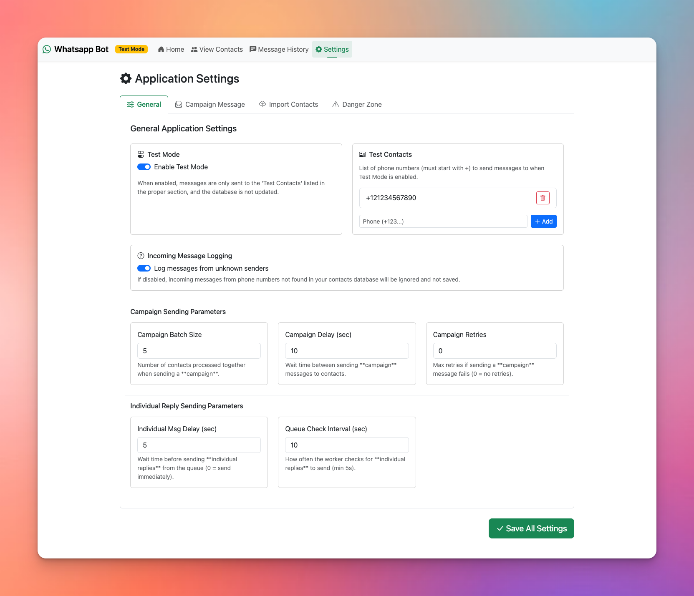
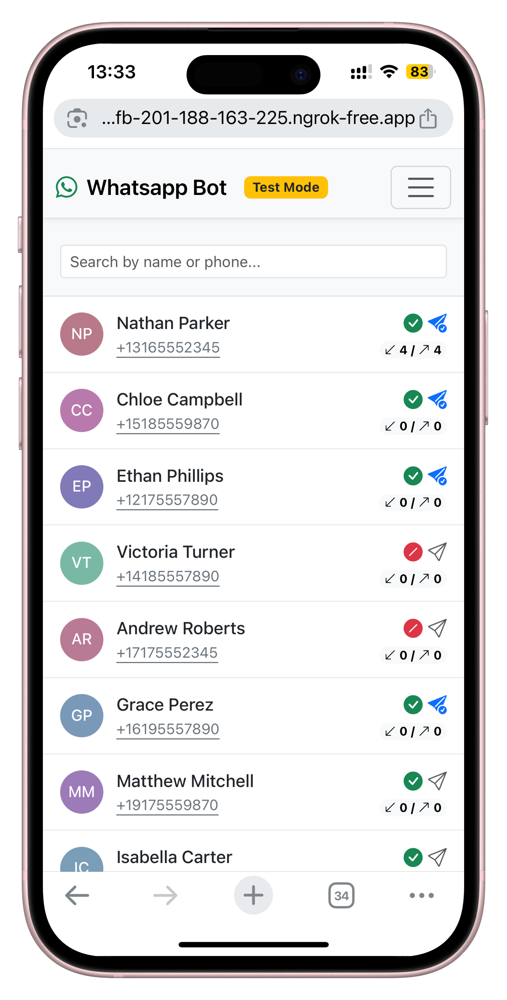

# WhatsApp Campaign & Marketing Bot
Automates sending of personalized messages via WhatsApp. 

## Overview
An free open-source tool using whatsapp-web.js that turns a plain WhatsApp account into a lightweight campaign engine. Drop your contacts into the web dashboard, write one template with placeholders like {name}, {phone}, etc and the bot handles the rest—sending each message, spacing them out so you stay under WhatsApp's radar, and even logging every reply. Perfect for makers, community managers, and small teams who need to reach many people without juggling complex or pricey platforms. ​


> [!WARNING]
> WhatsApp does not allow bots or unofficial clients on their platform, so this shouldn't be considered totally safe. Also it is not guaranteed you will not be blocked by using this method. This project is not affiliated, associated, authorized, endorsed by, or in any way officially connected with WhatsApp or any of its subsidiaries or its affiliates. The official WhatsApp website can be found at whatsapp.com. "WhatsApp" as well as related names, marks, emblems and images are registered trademarks of their respective owners. 


## Features

* Send personalized messages to multiple contacts using **customizable templates with placeholders**
* **A Full Web Interface** to manage all features and settings, everything can be done directly from the interface, no terminal needed.
* **Randomized Greetings/Farewells:** Enhance message variation by defining multiple greetings and farewells within your template. The bot randomly selects one for each message, reducing repetitive patterns and potentially lowering detection risk when sending bulk messages.
*   **CSV Import:** Imports contact data easily from CSV files.
* View contacts and message history.
* **Test Mode:** Allows sending campaigns to a predefined list without affecting production contact status.
* Reply to individual contacts directly through the web interface to maintain the full context of the conversation.
* Track message history and delivery status for each contact
*   **Configurable Worker Timings:** Set intervals for campaign checks, outgoing queue checks, and delays between both campaign and individual message sends via the Settings page
* Uses SQLite for storing contacts, messages, application settings, and the outgoing message queue.


## Technology Stack

*   Node.js
*   whatsapp-web.js
*   Express.js
*   EJS (Templating Engine)
*   SQLite3
*   PM2 (Process Manager)
*   Libraries: `qrcode-terminal`, `csv-parse`, `libphonenumber-js`, `multer`


## Prerequisites

*   Node.js (v14 or higher recommended)
*   npm
*   An active WhatsApp account for the bot

## Installation

1.  **Clone the repository:**
    ```bash
    git clone <YOUR_REPOSITORY_URL> whatsappbot
    cd whatsappbot
    ```
2.  **Install dependencies:**
    ```bash
    npm install
    ```
3.  **Setup Environment Variables:**
    *   Copy `.env.example` to `.env`.
    *   Fill in the necessary values in `.env`. 

## Configuration

*   **Application Settings:** Core parameters like message templates, worker timings, and logging preferences are configured via the **Settings page in the Web Interface**. These settings are stored in the `app_settings` table within the SQLite database.


## Database Setup

*   The database schema is defined in `db/schema.sql`.
*   The database file and tables are automatically created / updated when the application (either `web` or `worker`) starts, thanks to the `initializeDatabase()` function in `src/database.js`.
*   **Main Tables:**
    *   `contacts`: Stores contact information (name, phone, custom fields, status).
    *   `messages`: Logs all messages sent and received via the bot.
    *   `app_settings`: Holds application configuration set via the web UI (templates, timings, test mode, etc.).
    *   `outgoing_queue`: Temporarily stores individual messages sent from the UI before the worker processes them.

## Running Locally

You need to run the bot and the web server in **separate terminals**.

>The bot (`worker`) runs in the background, periodically checking for campaign start signals triggered via the web UI (`web`), and sends the personalized messages.


1.  **Run the WhatsApp Bot (Worker):**
    ```bash
    node main.js
    ```
    *   This starts the bot. On the first run, it will display a QR code in the terminal. Scan it with your WhatsApp application (Linked Devices).
    *   The bot loads its configuration from the database (using `src/configLoader.js`) and then connects and listens for incoming messages and campaign start signals.
    * `.wwebjs_auth/` directory is created by whatsapp-web.js for session storage)


2.  **Run the Web Interface:**
    ```bash
    node src/webserver/server.js
    ```
    *   This starts the Express web server.
    *   Access the interface in your browser, typically at `http://localhost:3000` (or the configured `PORT`).

## Deployment

This project offers two ways to define its processes for deployment platforms:

1.  **`ecosystem.config.js`:** Uses the PM2 process manager. This is recommended for robustness (auto-restarts, monitoring) and is used in the detailed Coolify instructions.
2.  **`Procfile`:** A simpler format often used by Heroku-like platforms and standard buildpacks (like Nixpacks or Cloud Native Buildpacks). It defines the `web` and `worker` processes directly.

**Important:** Regardless of the method, most deployment platforms will require you to configure **Persistent Storage** (Volumes) to preserve data between deployments. You must map:
*   `/app/db` to store the application database (`database.sqlite`).
*   `/app/.wwebjs_auth` to store the WhatsApp session information, avoiding the need to re-scan the QR code frequently.

Read [deployment.md](docs/deployment.md) to choose the method that best suits your deployment platform:

*   Deployment with Coolify (Using `ecosystem.config.js`)
*   Deployment with PM2 (Generic / Non-Coolify)
*   Deployment with Procfile (e.g., Heroku, Dokku, some Buildpacks)

## Usage (Web Interface)

Once deployed and running:

1.  **Access the Web UI:** Navigate to the domain you configured.
2.  **Configure Messages & Settings:** Use the Settings page to configure:
    *   **Campaign Message Templates:** 
    *   **General Settings:**
        *   *Test Mode:* Enable to send only to specified `Test Contacts` without affecting the main database.
        *   Campaign Batch Size, Campaign Delays, Worker Timings, among other settings.
    *   **Logging:**
        *   *Log Unknown Senders:* If enabled (default), incoming messages from numbers not in your contacts DB are logged. If disabled, they are ignored.



3.  **Import Contacts:** Use the "Import Contacts" form to upload a CSV file.
    *   The `can_contact` column can accept values like `TRUE`/`FALSE`, `1`/`0`, `YES`/`NO`. If omitted or invalid, it defaults to `1` (Yes), unless the phone number is invalid.
    * The `has_been_contacted` column is ignored, as the importer will always assign (0) (false) to the field for each new contact imported. It will be updated when the bot sends a message to that contact.

    

4.  **View Conversations & Send Replies:**
    *   View contact details custom fields, and contact status.
    *   Type and send an individual reply directly to any contact. **Messages are added to a queue for the worker to send.**


5.  **Prepare Campaign:** Click the "Start Campaign" button on the main dashboard.
6.  **Bot Sends Messages:**
    *   The `worker` process periodically checks for the campaign flag (based on *Campaign Check Interval*). If set, it resets the flag, reloads the latest configuration from the database, and starts sending campaign messages based on the templates, using the configured batch size and delay.
    *   The `worker` also periodically checks the `outgoing_queue` table (based on *Queue Check Interval*) for individual replies entered via the UI and sends them, respecting the *Individual Message Delay*.
7.  **Monitor:** Use the "Messages" and "Contacts" views in the web UI to see the status and history.


**Note on Failed Individual Replies:**

If an individual reply sent from the Contacts view fails (e.g., invalid number, network issue), the worker process (`main.js`) will log a detailed error to the console. The message record in the `outgoing_queue` table will be updated to `status='FAILED'` and include the error message. The main `messages` table will also log the attempt with `status='FAILED'`.




## License

This project is licensed under the GNU Affero General Public License v3.0 (AGPL-3.0), except for third-party components that maintain their own licenses:

- [whatsapp-web.js](https://github.com/pedroslopez/whatsapp-web.js) - Licensed under Apache License 2.0

This means you can use, modify, and distribute this software, but if you offer this service over a network, you must provide the complete source code under the same AGPL-3.0 license.


## Future Considerations

**Core Functionality:**
*   User authentication for the web interface.
*   Message scheduling (both campaigns and individual).
*   Add support to send / receive media (images, documents, etc.) - Only text messages are currently supported.

**UI/UX Enhancements:**
*   Real-time updates in the web UI (e.g., using WebSockets to show message status changes instantly).
*   Status indicators for queued/failed individual messages in the UI (currently logged to DB/console).
*   More advanced filtering/searching/sorting options in the Contacts and Messages views.

**Potential Features:**
*   Ability to create multiple campaigns with different templates/schedules.
*   Basic analytics/reporting on campaign performance.